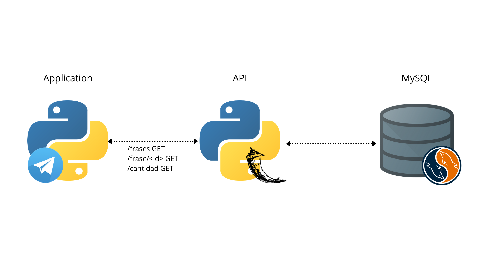
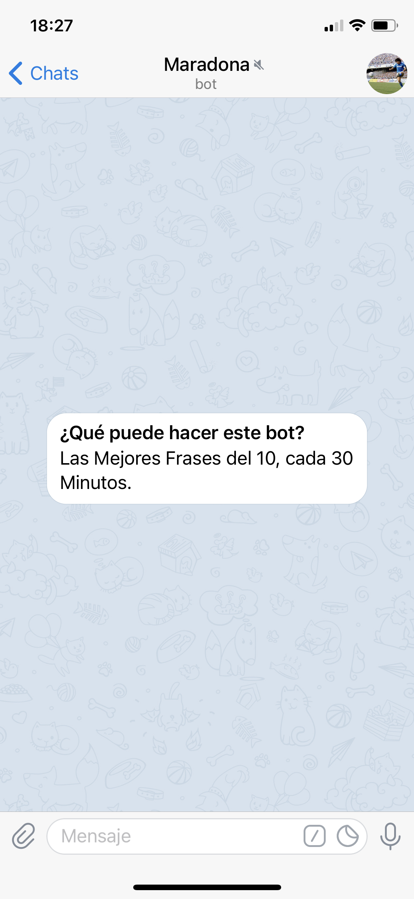
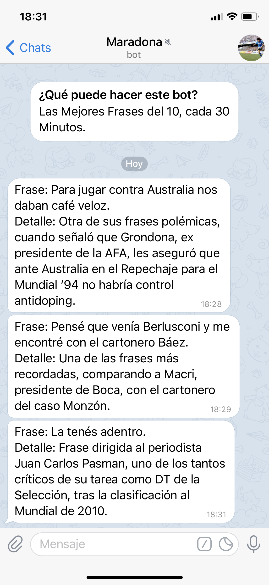

# Maradona BOT 

3-tier application to be able to build with Docker-Compose or with Kubernetes :wheel_of_dharma:.

The application is a :robot: Telegam Bot, with phrases by Maradona :one::zero:.

## Architecture

<p align="center">

</p>

## Docker Compose Way

#### Build the Compose

```bash
docker-compose build
```

#### Run the Docker's :whale:

```bash
docker-compose up
```

## The Kubernetes Way :wheel_of_dharma:

You must update **02-maradona-secrets.yaml** with your secrets.

TOKEN_TELEGRAM
CHAT_ID
MYSQL_ROOT_PASSWORD

#### Deploy the K8S manifiests

On kubernetes folder:

```bash
kubectl apply -f ./
```

Surely the code can be improved. Adding limits to the manifestos, the idea was to play with both ways. I hope it helps you.

## Screenshots

<p align="center">

</p>

<p align="center">

</p>

## Create your bot with BotFather & generate your Token

[How To](https://core.telegram.org/bots)
